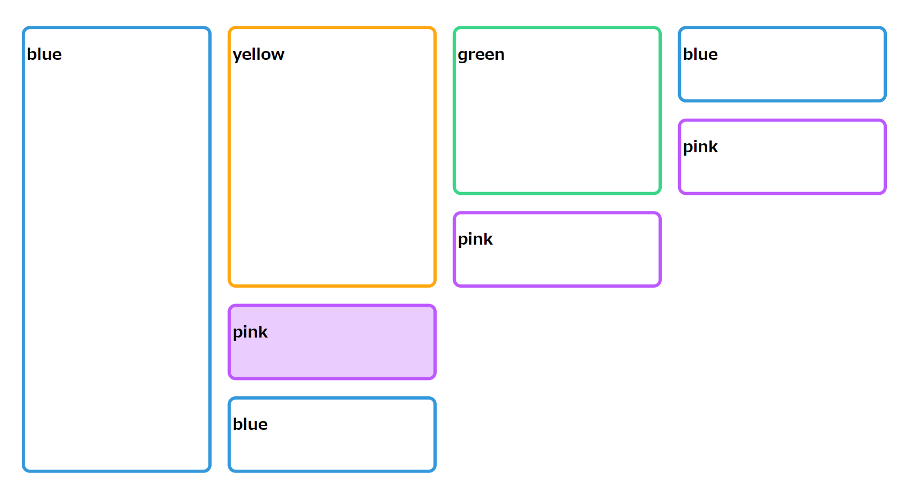

# Collapsible Color Partition Layout

This is a demo code for creating Collapsible Color Partition Layout using D3.js

# Author
- Tomohiro Nishida
    - Designer
    - Specially Appointed Assistant Professor ([Takanori Ito lab, Nagoya Institute of Technology](http://ti-di.info/))
- [Akira Kamiya (GitHub)](https://github.com/akamiya208)
    - Programmer
    - Student ([Shun Shiramatsu lab, Nagoya Institute of Technology](http://www.srmt.nitech.ac.jp/))
